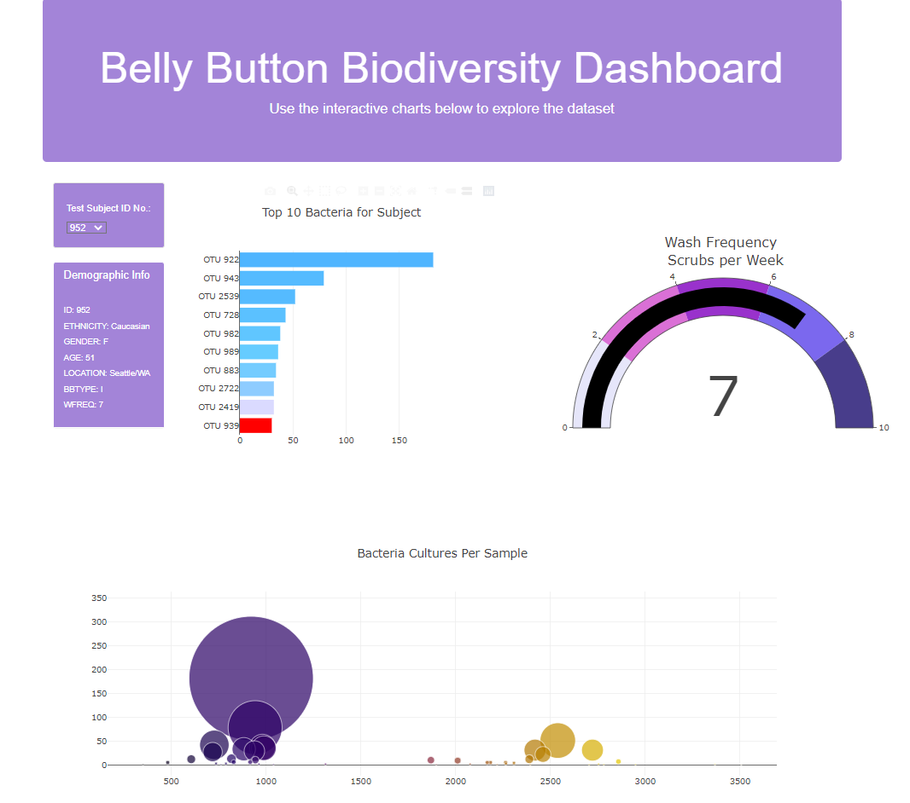
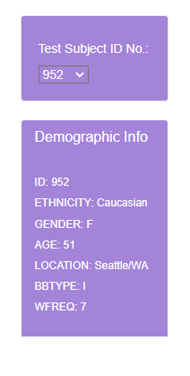
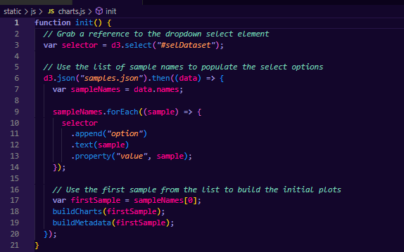
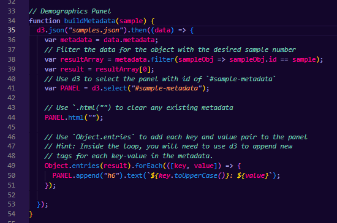
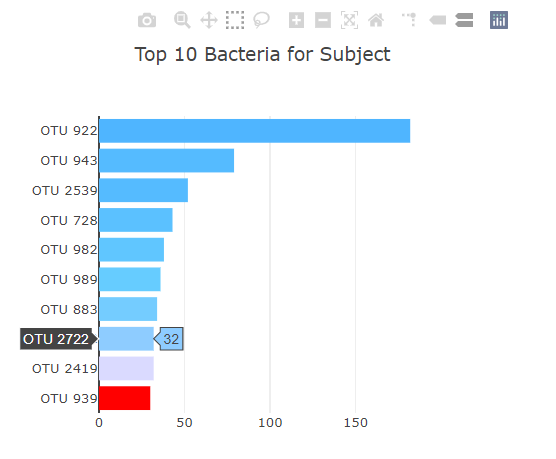
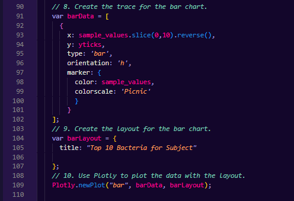
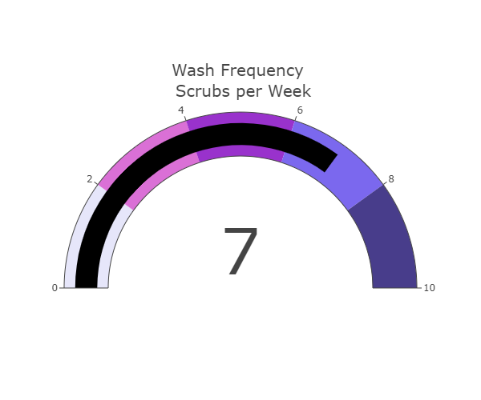
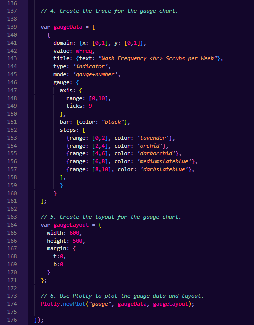

# Bellybutton Biodiversity
Transforming bellybutton biodiversity JSON data into interactive charts using Plotly, HTML, and JavaScript.

## Webpage overview
Example of webpage view for selected test subject.
 

 

## Dropdown Menu and Demographic Info Box
Use the dropdown menu to select a test subject to display their demographic info and bellybutton biodiversity data.
 

 
 
Code: Dropdown Menu 

 

Code: Demographics Panel 

 

## Top 10 Bacteria Bar Chart
Bar chart displaying the top 10 most abundant bacteria for a particular test subject. Hovering the mouse over each bar will display the exact number counted for each bacteria. 
 

 
 
Code: Bar Chart 

## Wash Frequency Gauge Chart
Gauge chart will display frequency (per week) that the selected test subject reported washing their bellybutton. 

 
 
Code: Gauge Chart 
