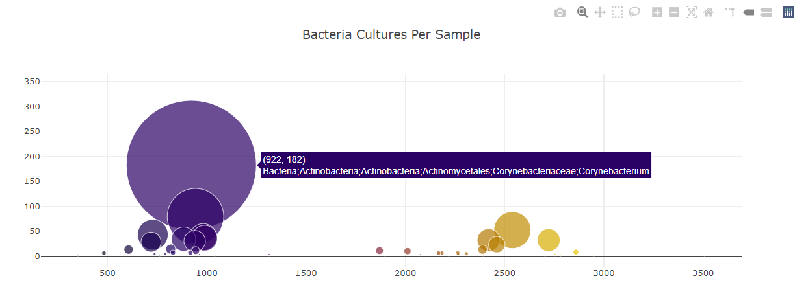
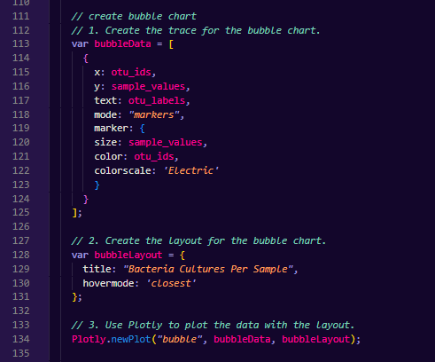

# Bellybutton Biodiversity
Transforming bellybutton biodiversity JSON data into interactive charts using Plotly, HTML, and JavaScript.

### Navigation
- [Webpage Overview](https://github.com/spicyyramen/bellybutton-biodiversity/tree/main#webpage-overview)
- [Dropdown Menu & Demographics Panel](https://github.com/spicyyramen/bellybutton-biodiversity/tree/main#dropdown-menu-and-demographic-info-box)
- [Bar Chart](https://github.com/spicyyramen/bellybutton-biodiversity/tree/main#top-10-bacteria-bar-chart)
- [Gauge Chart](https://github.com/spicyyramen/bellybutton-biodiversity/tree/main#wash-frequency-gauge-chart)
- [Bubble Chart](https://github.com/spicyyramen/bellybutton-biodiversity/tree/main#cultures-per-sample-bubble-chart)

## Webpage
Example of webpage view for selected test subject.
 

 

## Dropdown Menu and Demographics Panel
Use the dropdown menu to select a test subject to display their demographic info and bellybutton biodiversity data.
 

 
 
Code: Dropdown Menu 

 

Code: Demographics Panel 

 

## Top 10 Bacteria Bar Chart
Bar chart displaying the top 10 most abundant bacteria for a particular test subject. Hovering the mouse over each bar will display the exact number counted for each bacteria. 
 

 
 
Code: Bar Chart 

## Wash Frequency Gauge Chart
Gauge chart will display frequency (per week) that the selected test subject reported washing their bellybutton. 

 
 
Code: Gauge Chart 

## Cultures per Sample Bubble Chart
Bubble chart displays number of bacterial cultures found for the selected test subject. The size of each bubble is indicative of the culture count for each type of bacteria. On hover, the bacteria ID (x) and culture count (y) will be displayed, along with the phylogeny of bacteria (ex. Corynebacterium). 
 
 
Code: Bubble Chart 
 
